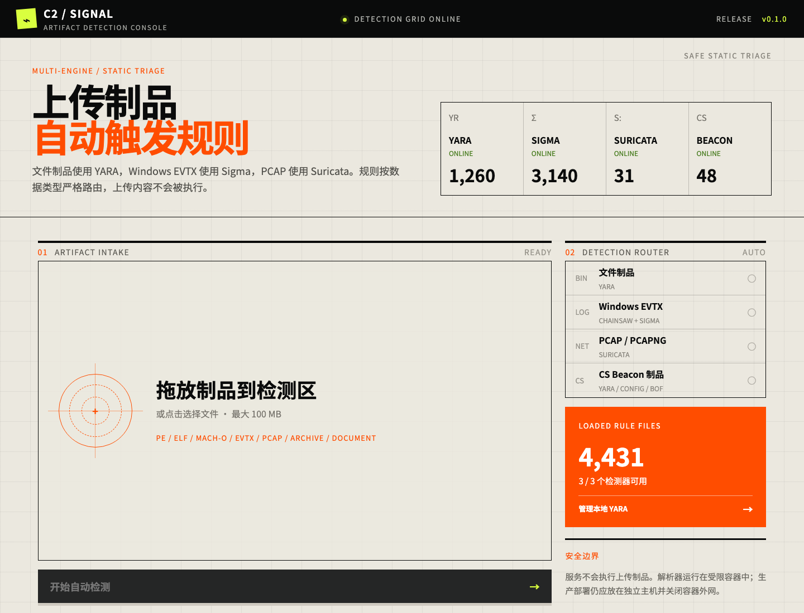
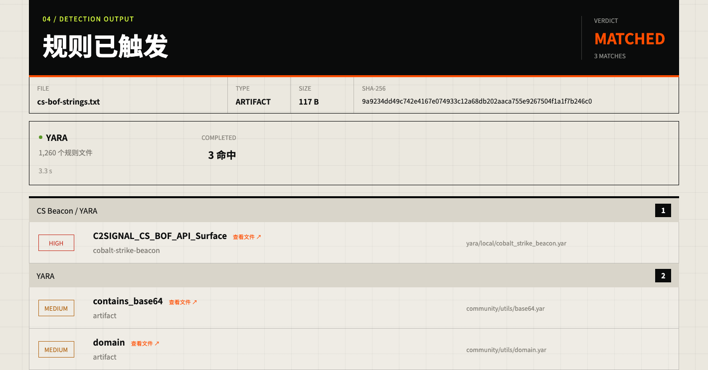
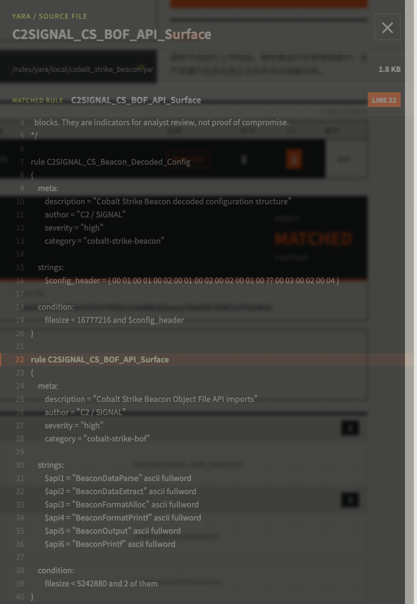
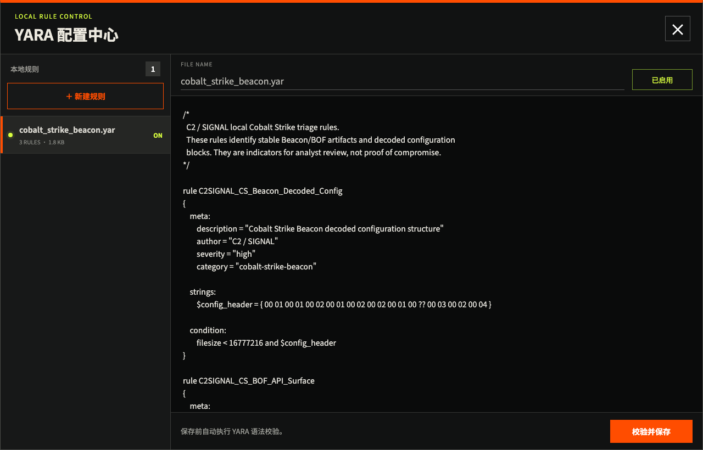

# C2 Signal

[English](docs/README.en.md)

Docker 启动的多引擎制品检测工作台：Next.js 静态前端 + Go API + YARA + Chainsaw/Sigma + Suricata。

当前版本：**v0.1.0** · 开源许可证：**MIT**

## 界面预览

### 检测控制台



### Cobalt Strike 命中结果

上传制品后展示检测器状态、SHA-256、命中分组、严重度与规则来源。



### YARA 规则精确定位

点击命中的 YARA 规则即可查看源文件，并自动定位到具体规则声明和行号。



### 本地 YARA 管理

支持新建、编辑、语法校验、启用和停用本地规则。



## 快速启动

仅使用内置本地规则启动：

```bash
make up
```

初始化固定版本的社区规则后启动完整规则集：

```bash
make rules
make up
```

打开：<http://127.0.0.1:8080>

查看日志或停止：

```bash
make logs
make down
```

首次构建会编译 Chainsaw，时间较长。后续启动使用 Docker 缓存。

## 检测路由

| 上传类型 | 检测器 | 规则来源 |
|---|---|---|
| 普通文件、二进制、文档、压缩包 | YARA | Yara-Rules、Elastic protections-artifacts、Cobalt Strike YARA、DIE YARA、本地规则 |
| Cobalt Strike Beacon / BOF / 解码配置 | YARA + CS 专用分类 | Te-k、Elastic 与 `rules/yara/cobalt_strike_beacon.yar` |
| Windows `.evtx` | Chainsaw | SigmaHQ Windows 规则 |
| `.pcap` / `.pcapng` | Suricata | `rules/suricata/` 与 Suricata 内置协议事件规则 |

Elastic `detection-rules`、Splunk `security_content` 和 Sigma 不是同一种可执行规则格式。Elastic/Splunk 规则需要各自的事件字段和查询后端，因此不会错误地应用到普通二进制文件。当前平台对上传 EVTX 使用 SigmaHQ；对普通制品使用 YARA；对 PCAP 使用 Suricata。引擎不会跨格式叠加，以避免把网络载荷字符串当作文件恶意特征。

## 输出内容

- 文件名、大小、媒体类型与 SHA-256。
- 实际运行的检测器、状态、规则文件数和耗时。
- 触发的规则名、检测器、严重度、分类和规则来源。
- 最近扫描历史、命中数与 CS Beacon 专项命中数；点击历史记录可恢复完整结果。
- `clean`：所有适用检测器完整执行且无命中。
- `matched`：至少一条规则触发。
- `inconclusive`：检测器缺失、超时、跳过或出错；不能视为安全。

“无命中”只表示已加载规则没有匹配，不是安全判定。

## 自定义规则

- YARA：在页面“管理本地 YARA”中创建或编辑；保存前自动编译校验，保存后自动热重载。
- 本地 YARA 保存在 Docker 卷 `yara-local`；启用文件使用 `.yar/.yara`，停用文件增加 `.disabled` 后缀。
- Suricata：放入 `rules/suricata/`，扩展名 `.rules`。
- Sigma：运行 `make rules` 后从仓库内忽略的 `rulesets/sigma/rules/` 只读挂载。

社区、Elastic、Cobalt Strike 和 DIE YARA 仓库由 `scripts/fetch-rules.sh` 拉取固定版本并保持只读，页面仅管理本地规则。Suricata 或外部仓库规则变更后需要重启：

```bash
./scripts/compose.sh restart scanner
```

## API

```text
GET  /api/v1/health
GET  /api/v1/rules
GET  /api/v1/scans?limit=30
POST /api/v1/scans        multipart/form-data, field: file
GET  /api/v1/scans/{id}
DELETE /api/v1/scans/{id}
GET  /api/v1/scans/{id}/rule?name={yara_rule}
GET  /api/v1/yara/rules
GET  /api/v1/yara/rules/{name}
PUT  /api/v1/yara/rules/{name}
PATCH /api/v1/yara/rules/{name}/enabled
```

上传返回 `202 Accepted` 和任务 ID。前端轮询任务直到 `completed` 或 `failed`。

## 安全设计

- 不执行上传文件，不使用上传文件名构造存储路径。
- 默认限制 100 MB、2 个并发任务、每次扫描 180 秒。
- 默认扫描结束后删除上传文件；扫描元数据与结果以 JSON 保存在 Docker 数据卷 `/data/history`。
- 解析命令通过参数数组调用，不经过 shell。
- 容器只读、非 root、移除全部 capabilities、禁止提权并限制 PID/CPU/内存。
- Web 默认绑定宿主机 `127.0.0.1:8080`，容器使用独立 bridge 网络。若通过 `C2_SIGNAL_BIND=0.0.0.0 make up` 对外开放，必须通过防火墙限制来源或在前方增加身份认证与 TLS。扫描器不会根据制品内容发起网络请求；如需强制阻断出站流量，应使用宿主防火墙或独立 VM 的网络策略。

解析恶意文件仍可能触发第三方解析器漏洞。生产环境应在独立主机或虚拟机运行，不要挂载 Docker socket、宿主敏感目录或生产凭据。若需要多用户访问，应在前方增加身份认证、TLS、审计日志和配额。

## 配置项

| 环境变量 | 默认值 | 说明 |
|---|---:|---|
| `C2_SIGNAL_BIND` | `127.0.0.1` | Compose 发布到宿主机的监听地址 |
| `C2_SIGNAL_PORT` | `8080` | Compose 发布到宿主机的端口 |
| `MAX_UPLOAD_BYTES` | `104857600` | 最大上传字节数 |
| `SCAN_TIMEOUT_SECONDS` | `180` | 单任务总超时 |
| `MAX_CONCURRENT_SCANS` | `2` | 并发扫描任务数 |
| `KEEP_UPLOADS` | `false` | 是否保留上传文件 |
| `HISTORY_DIR` | `/data/history` | 持久化扫描结果目录 |
| `HISTORY_LIMIT` | `200` | 最多保留的历史任务数 |
| `MANAGED_YARA_ROOT` | `/rules/yara/local` | 页面可编辑的本地 YARA 目录 |
| `YARA_ROOTS` | `/rules/yara` | YARA 根目录，冒号分隔 |
| `SIGMA_ROOT` | `/rules/sigma` | Sigma 根目录 |
| `SURICATA_RULE_ROOTS` | `/rules/suricata:/opt/suricata/share/suricata/rules` | Suricata 规则根目录，冒号分隔 |

## 本地开发

前端：

```bash
cd frontend
npm install
npm run dev
```

Go API（需要正确的 Go 1.24+ 工具链）：

```bash
cd backend
go test ./...
go run ./cmd/server
```

Next.js 使用 `output: 'export'`，生产构建生成的静态文件由 Go 服务直接提供，不需要额外 Node.js 运行时。

## 开源发布前

项目代码使用 [MIT 许可证](LICENSE)。版本记录见 [CHANGELOG.md](CHANGELOG.md)，公开发布前检查项见 [发布检查清单](docs/release-checklist.md)。第三方规则仓库不进入本项目 Git 历史，各自许可证信息见 [THIRD_PARTY.md](THIRD_PARTY.md)。
